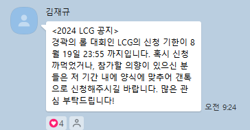
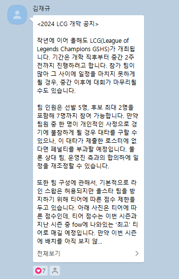

# LCG

###### 23002 강민준

---

<div style="
  display: flex;
  justify-content: space-between;
  align-items: center;   /* ← 수직 중앙 정렬 */
  height: 100%;           /* ← 슬라이드 전체 높이 사용 */
">
  
  
</div>

---

## 경기과학고에서 개최하는 LCG(LOL Champions GSHS)에 참여하기 위해 경곽이는 선수들을 사려고 한다. 다만 경곽이는 올해 자금난에 시달려 최고의 선수들로 구성하기에는 어려움이 있어 선택과 집중을 하려고 한다. 

---

## 다음 표는 선수들의 라인과 이름, 가격을 나타낸 것이다.
| 가격  | 탑   | 정글  | 미드  | 원딜  | 서폿  |
| --- | --- | --- | --- | --- | --- |
| 5$  | **A**   | **F**   | **K**   | **P**   | **U**   |
| 4$  | **B**   | **G**   | **L**   | **Q**   | **V**   |
| 3$  | **C**   | **H**   | **M**   | **R**   | **W**   |
| 2$  | **D**   | **I**   | **N**   | **S**   | **X**   |
| 1$  | **E**   | **J**   | **O**   | **T**   | **Y**   |

## 각 선수들은 두가지 능력치를 지닌다. 
## 오더 능력치와 교전 능력치이다. 

---

| 능력치 | 탑 | 정글 | 미드 | 원딜 | 서폿 |   | 탑 | 정글 | 미드 | 원딜 | 서폿 |
| ---:  | :--: | :--: | :--: | :--: | :--: | :--: | :--: | :--: | :--: | :--: | :--: |
| 6     |      |      |  K   |      |      |     |     |      |   K   |      |      |
| 5     |  A   |  F   |      |  P   |  U   |     |     |   F   |      |      |  U   |
| 4     |      |  G   |  L   |      |  V   |     |  A   |  G   |  L   |  P   |  V   |
| 3     |  B   |      |  M   |  Q   |      |     |      |  H   |      |      |  W   |
| 2     |  C   |  H   |  N   |  R   |  W   |     |  B   |      |  M   |  Q   |      |
| 1     |  D   |  I   |      |  S   |  X   |     |  C   |  I   |  N   |  R   |  X   |
| 0     |      |      |  O   |  T   |  X   |     |  D   |  J   |      |      |  Y   |
| -1    |      |  J   |      |      |      |     |  E   |      |      |  S   |      |
| -2    |  E   |      |      |      |  Y   |     |      |      |  O   |  T   |      |

---

## 조건
## 1. 각 라인 별로 한명 이상의 선수는 선발하여야 한다. (단, 예비 선수 두명 선발이 가능하다)
## 2. 선수 영입 예산은 최대 18$이다. 
## 3. 성능평가식은 다음과 같다.
$$\sum_{i}^{n} a_i \times \sum_{i}^{n} b_i$$

---

## ***입력***
## 5$\times$ 5 행렬 $A$와 $B$를 입력받는다.
## 행렬 $A$는 오더 능력치를, 행렬 $B$는 교전 능력치를 의미한다. 
## ***출력***
## 성능평가식으로 나온 값을 출력한다. 
## 최적의 조합 선수 이름을 공백으로 구분하여 출력한다. 

---

## 예시 입출력

<style>
/* 모든 코드 블록 텍스트를 검은색으로 */
section pre code {
  color: #000 !important;
}
</style>

<div style="display:flex; justify-content:space-between; color:#000;">
<div style="width: 48%; padding-right: 1rem;">

#### Input
```
5 5 6 5 5
3 4 4 3 4
2 2 3 2 2
1 1 2 1 0
-2 -1 0 0 -2

4 5 6 4 5
2 4 4 2 4
1 3 2 1 3
0 1 1 -1 1
-1 0 -2 -2 0
```
</div>

<div style="width: 48%; padding-left: 1rem;">

#### Output
```
256
D H K P W
```
</div>

---

## O(1)

---

## DFS

---

#### DFS로 5명, 6명, 7명 모두 탐색

#### 가지치기로 비용 초과·인원 초과·인원 부족 경우를 빨리 배제

#### 완성 시점에만 라인·예산·성능 평가

#### 최종적으로 (교전 합)×(오더 합) 이 최대인 조합을 출력

---

```cpp
void dfs(int idx, int picked, int cost, vector<int>& sel);
```
### idx : 지금 고려하는 선수의 인덱스 (0~24)
### picked : 지금까지 고른 선수 수
### cost : 지금까지 소비한 예산 합
### sel : 지금까지 선택된 선수들의 인덱스 목록

---

## 가지치기
#### 1. 예산 초과
```cpp
if(cost > 18) return;
```
#### 2. 7명 초과
```cpp
if(picked >= 7) return;
```
#### 3. 남은 선수로도 최소 5명 못 채울 때
```cpp
if (25 - idx < 5 - picked) return;
```

---

## 완성조건
```cpp
if (idx == 25 || picked == 7) {
    // 5명 이상(picked>=5)인 경우에만 결과 평가
    // → 라인별 1명, 비용 ≤18, 성능 평가까지 한 번에 처리
    return;
}
```
#### 1. 모든 선수를 고려한 경우
#### 2. 최대 7명을 뽑은 경우 =

---

## 조합 평가 순서
#### 1. picked >= 5인지 확인
#### 2. laneOK[0..4] 로 각 라인(탑·정글·미드·원딜·서폿)에 최소 1명씩 뽑혔는지 검사
```cpp
bool laneOK[5] = {};
for(int id: sel) laneOK[id/5] = true;
```

#### sumSk = ∑ 교전능력, sumOr = ∑ 오더능력 계산

#### score = sumSk * sumOr 로 성능 평가, bestScore 갱신

---

## 재귀 분기

#### 완성 조건이 아니면, 현재 선수(idx)를 뽑는 경우와 뽑지 않는 경우로 나눠서 재귀:
```cpp
// (1) 뽑기
sel.push_back(idx);
dfs(idx+1, picked+1, cost + price(idx), sel);
sel.pop_back();

// (2) 안 뽑기
dfs(idx+1, picked, cost, sel);
````

#### 이 두 분기를 타고 내려가면서, 모든 “5명 이상 7명 이하”의 조합을 탐색하고, 완성 조건에 해당할 때마다 성능을 평가한다.

---

# 감사합니다

---
[](https://github.com/minjn12/2025gsproblemmaking/blob/main/)

